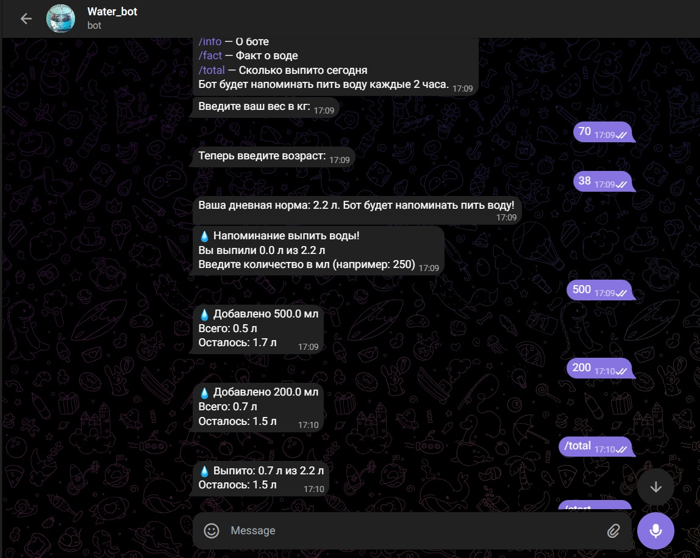

# 💧 Water Reminder Bot  

  

**Water Reminder Bot** – ваш персональный помощник для поддержания водного баланса! 🌊 Этот Telegram-бот поможет вам не забывать пить воду, рассчитает вашу дневную норму и будет регулярно напоминать о необходимости пополнить запас жидкости в организме.  

## 🌟 Особенности  

✅ **Персонализированные рекомендации** – бот рассчитывает вашу дневную норму воды на основе веса и возраста.  
⏰ **Умные напоминания** – автоматические уведомления каждые 2 часа.  
📊 **Отслеживание прогресса** – статистика выпитой воды за день.  
💡 **Полезные факты** – случайные интересные факты о воде.  

## 🚀 Как начать  

1. **Запустите бота** командой `/start`.  
2. **Укажите ваш вес и возраст** – бот рассчитает дневную норму воды.  
3. **Получайте напоминания** и вводите количество выпитой воды в мл (например, `250`).  

## 📌 Основные команды  

- `/start` – начать работу с ботом  
- `/help` – справка по командам  
- `/info` – информация о боте  
- `/fact` – случайный факт о воде  
- `/total` – сколько воды выпито сегодня  

## 🛠 Технологии  

- **Python 3** + **aiogram** (асинхронный фреймворк для Telegram ботов)  
- **Pytz** для работы с временными зонами  
- **Dotenv** для хранения конфигурации  

## 📊 Пример работы  

  

## 📈 Почему важно пить воду?  

💧 Вода – основа жизни! Она участвует в обмене веществ, регулирует температуру тела, улучшает работу мозга и поддерживает здоровье кожи.  

🔹 *"Даже легкое обезвоживание может снизить продуктивность на 20%!"*  

## ⚙ Установка  

1. Клонируйте репозиторий:  
   ```bash
   git clone https://github.com/ваш-репозиторий/water-reminder-bot.git
   ```  
2. Установите зависимости:  
   ```bash
   pip install -r requirements.txt
   ```  
3. Создайте файл `.env` и добавьте токен бота:  
   ```env
   TELEGRAM_BOT_TOKEN=ваш_токен
   ```  
4. Запустите бота:  
   ```bash
   python main.py
   ```  

---  

💙 **Пейте воду и будьте здоровы!** Ваш *Water Reminder Bot* всегда напомнит, когда это нужно.  

🔗 *Разработано с заботой о вашем здоровье*  

---  

